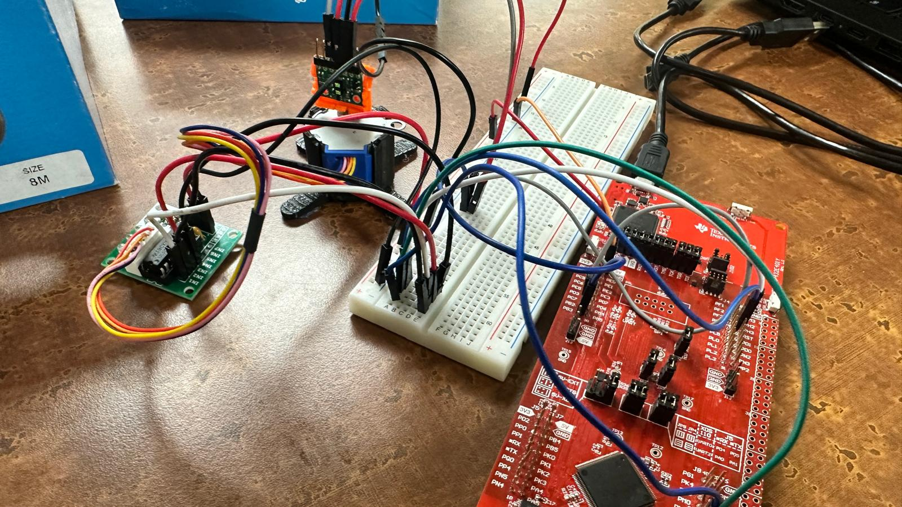
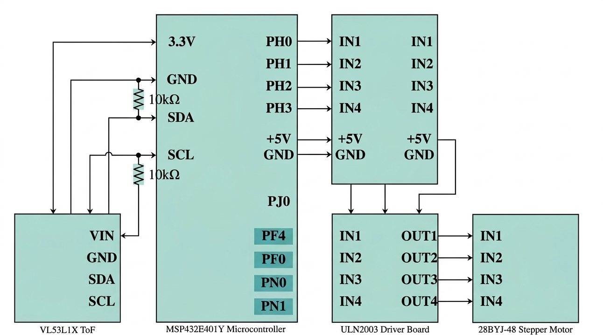
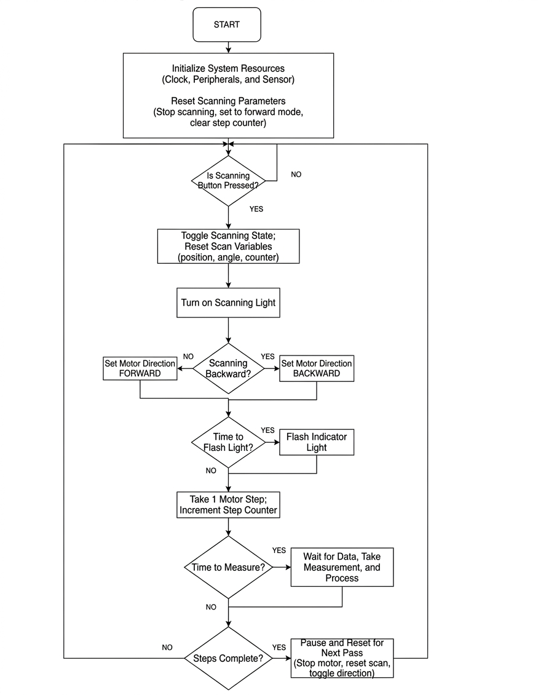
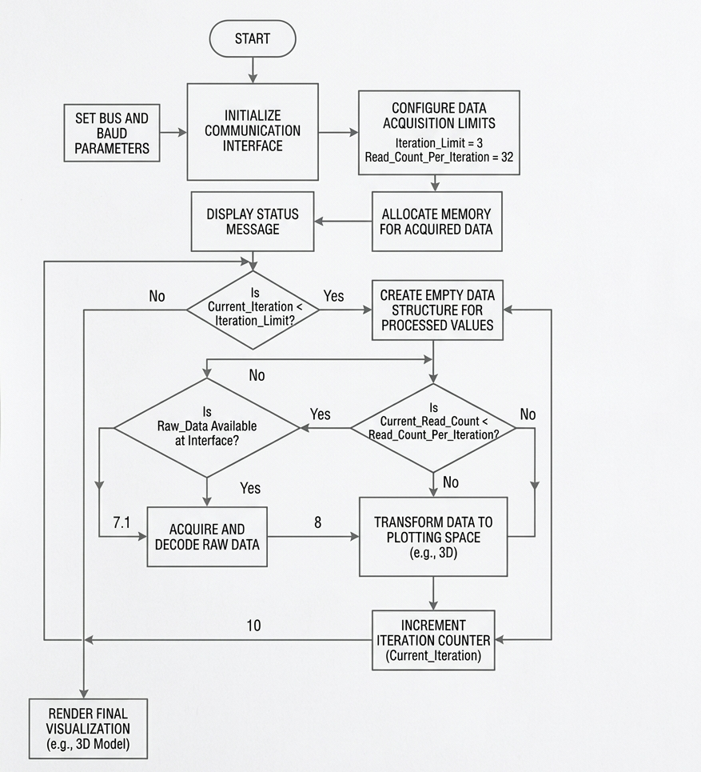
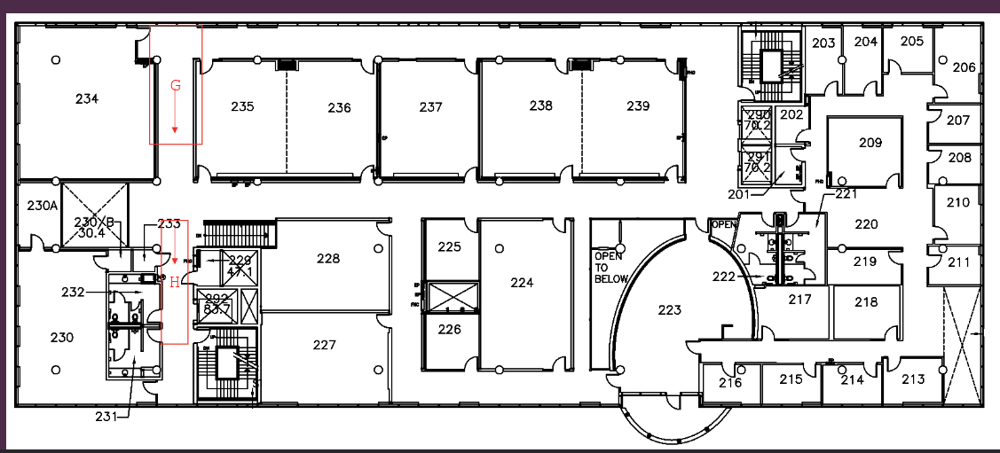
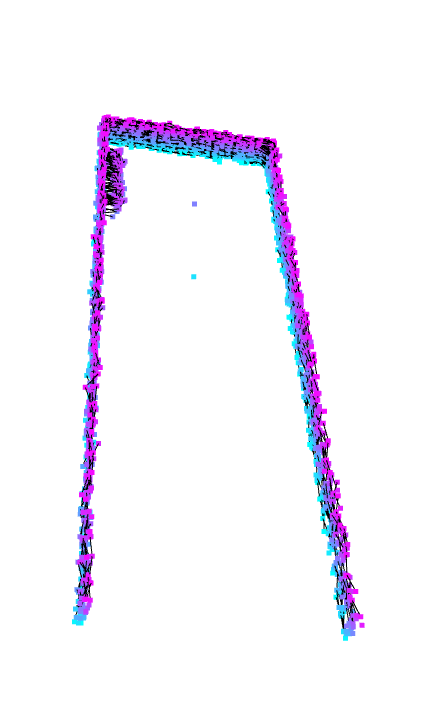

# 3D LiDAR System Using MSP-EXP432E401Y and VL53L1X ToF Sensor

**Author:** Vedant Jhawar

## Design Overview

This device was developed as a low-cost, compact alternative to traditional LiDAR (Light Detection and Ranging) systems. It is designed to be portable and capable of mapping indoor environments in three dimensions. The core of the system is the Texas Instruments MSP-EXP432E401Y microcontroller, which interfaces with an onboard button, three onboard LEDs, a ULN2003 driver board, a 28BYJ-48 stepper motor, and a Pololu VL53L1X Time-of-Flight (ToF) sensor.

- A 3D spatial map is generated and displayed using Python.
- The ToF sensor sends real-time distance data to the microcontroller via the I2C protocol.
- The microcontroller forwards this data live to a PC over UART at 115200 bps.
- Power is supplied through a 5V micro-USB connection.
- An LED on PF0 indicates measurement progress, while another status LED is on PN0.
- The microcontroller runs at a 32 MHz bus speed.
- Two onboard push buttons are used: one to rotate the stepper motor and another to start ToF data acquisition and transmission.

*Figure 1: Physical Implementation of the LiDAR System*

## Hardware Components

| Component                        | Details                                      |
|----------------------------------|----------------------------------------------|
| MSP-EXP432E401Y Microcontroller  | Datasheet, $47.99                            |
| 28BYJ-48 Stepper Motor           | Datasheet, $24.85                            |
| Pololu VL53L1X                   | Datasheet, $11.39                            |
| ULN2003 Stepper Motor Driver     | Datasheet, $1.95                             |

**Total Estimated Cost:** ~$86.18 CAD

## Software Components

| Software        | Use                          |
|----------------|------------------------------|
| Python          | 3D Mapping Visualization     |
| Keil MDK (C)    | Microcontroller Functions    |

## Key Features

### MSP-EXP432E401Y Microcontroller
- ARM Cortex-M4 32-bit CPU with floating-point support
- Maximum CPU clock: 120 MHz; design bus speed: 32 MHz
- Interfaces: JTAG, Micro USB, Ethernet
- 1 MB flash memory, 256 kB SRAM
- I2C support with high-speed mode
- UART at 115200 bps for real-time data communication
- Onboard user button with debouncing and pull-up/down resistors
- Three user-controllable LEDs
- GPIO pins support interrupts, PWM, and ADC

### 28BYJ-48 Stepper Motor
- Unipolar 4-phase stepper motor
- Standard stride angle: 5.625° (64 steps per revolution)
- Configured to use 11.25° (32 steps per revolution) in full-step mode
- Operating voltage range: 5-12 VDC

### ULN2003 Stepper Motor Driver
- Accepts 5-12 V power input
- Includes onboard 4-channel signal outputs
- Uses Texas Instruments ULN2003AN driver IC

### Pololu VL53L1X Time-of-Flight (ToF) Sensor
- I2C communication at 100 kbps
- Up to 27° field of view
- Operating voltage: 2.6V - 5.5V
- Emits 940 nm invisible Class 1 VCSEL laser
- Three ranging modes: Short (up to ~130 cm), Medium (up to ~300 cm), Long (up to ~400 cm)

## Block Diagrams

*Figure 2: Component Block Diagram*

*Figure 3: Data Flow Graph*

## Pinout Description

| Pin Signal           | Description                              |
|----------------------|------------------------------------------|
| GPIO Port H [H0:H3]  | PWM Output for Stepper Motor Driver      |
| GPIO Port J [J0]     | GPIO Polling (Onboard button)            |
| GPIO Port N [N0:N1]  | Toggle/Flash (Onboard LED D1, D2)        |
| GPIO Port F [F4]     | Toggle/Flash (Onboard LED D3)            |
| GPIO Port E [E0]     | PWM (Bus speed verification)             |
| GPIO Port B2 (SCL)   | I2C Clock Line                           |
| GPIO Port B3 (SDA)   | I2C Data Line                            |
| MicroUSB (UART)      | Outputs data to computer                 |

## Communication Protocol Parameters

| Parameter              | Value                                      |
|------------------------|--------------------------------------------|
| I2C Frame              | 1 start, 7 address, 1 R/W, 1 ACK, 8 data, 1 ACK, 1 stop |
| I2C Clock              | 100 kbps                                   |
| I2C Address (VL53L1X)  | 0x29                                       |
| UART Frame             | 1 start, 8 data, 1 stop (no parity)       |
| UART Baud Rate         | 115200 bps                                 |

## Power Requirements

| Component                    | Power Supply            |
|------------------------------|-------------------------|
| MSP-EXP432E401Y Microcontroller | +5V from MicroUSB cable |
| ULN2003 Stepper Motor Driver | +5V from MSP-EXP432E401Y |
| 28BYJ-48 Stepper Motor       | +5V from ULN2003 Driver |
| Pololu VL53L1X ToF           | +3.3V from MSP-EXP432E401Y |

## How It Works

1. The user presses the onboard button PJ0 to start the system.
2. The stepper motor rotates 360° in increments of 11.25°, stopping 32 times to take measurements.
3. The VL53L1X ToF sensor measures distance using a 940 nm Class 1 laser and SPAD receiver array.
4. Distance is calculated using:  
   `Δd = c * (Δt / 2)` where `c` is the speed of light.
5. Each distance measurement is transmitted via UART to a computer.
6. Python receives the data, converts distance and angle into Cartesian coordinates (y, z), and assigns an x-coordinate (scan count).
7. Open3D is used to generate a 3D scatter plot.

### Coordinate Conversion Example

If distance = 1500 mm at angle = 45°:

- `y = 1500 * cos(45°) = 1060.7 mm`
- `z = 1500 * sin(45°) = 1060.7 mm`

If second scan layer: `x = 1` → Point: `(1, 1060.7, 1060.7)`

## Instructions

1. **Connect Hardware**  
   Connect the MSP-EXP432E401Y to the computer via Micro USB. Find the COM port in Device Manager labeled "XDS110 Class Application/User UART (COM#)".

2. **Configure Python Script**  
   - Change `port = "COM4"` to the correct COM port.  
   - Change `num_scans = 3` to desired number of full 360° revolutions.  
   - Change `values_per_scan = 32` to match measurements per rotation.

3. **Verify Wiring**  

   
   *Figure 7: LiDAR System Circuit Diagram*

4. **Load Firmware**  
   > **Note:** This repository does not include the Keil workspace or project files. You will need to manually create a new Keil project for the MSP-EXP432E401Y and copy/paste the microcontroller code into it. The code files (e.g., `main.c`) are provided in the `/src` directory of this repo.
   
   Once your Keil project is set up:
   - Click Translate → Build → Load.

   
   *Figure 8: Keil Code Flowchart*

5. **Reset**  
   Press the reset button next to the microUSB after flashing.

6. **Run Python Script**  
   Nothing will happen yet.

7. **Start Scanning**  
   Return to Keil and press onboard button PJ0.  
   - LED D4 turns on  
   - Stepper motor spins  
   - ToF transmits data (check Python Command Window for distances)

8. **Move Device (Optional)**  
   After one full rotation, the motor pauses, reverses, and pauses again. Move the LiDAR system forward one unit during this time.

9. **Visualization**  
   After the desired number of scans, Python automatically generates a 3D scatter plot.

   
   *Figure 9: Python Visualization Flowchart*

## Visualization

- Python libraries: `pyserial`, `NumPy`, `Open3D`
- Incoming distance values are parsed and grouped into scans (32 measurements per scan).
- Polar to Cartesian conversion is done on the PC.
- Open3D renders the point cloud (front, top, angle views).

## Experimental Validation

To evaluate the system in a real indoor environment, a hallway on the second floor of the Engineering Technology Building (ETB) was scanned.

*Figure 4: Engineering Technology Building (ETB) second floor map showing the approximate scan location*

*Figure 5: Reference photo of the scanned hallway*

*Figure 6: Hallway Scan from Multiple Perspectives*

*Figure 7: Hallway Scan from Multiple Perspectives*

*Figure 8: Hallway Scan from Multiple Perspectives*

*Figure 9: Hallway Scan from Multiple Perspectives*

The reconstructed hallway scan captures the dominant geometry of the environment, including two approximately parallel side walls and an end boundary visible in the top view. Minor curvature and point spread are present due to step angle quantization, sensor noise, and slight inconsistencies in manual translation between scans. Despite these limitations, the output demonstrates that the system can recover recognizable indoor structure using low-cost hardware.

## Limitations

- Stepper motor must reverse after each 360° scan (prevents wire tangling but introduces delays).
- Non-accumulative step error: ±5%.
- Minimum step angle: 0.703125°.
- Minimum 2 ms delay between step activations.
- VL53L1X max reliable range: 4 meters (reduced on non-reflective/textured surfaces).
- Timing budget (20-1000 ms) affects accuracy and scan duration.
- I2C limited to 100 kbps in this design.
- System speed limited by stepper motor rotation and ToF timing budget.
- UART 115200 bps verified stable on Windows 11 for XDS110 device.
- Python visualization requires complete, correctly ordered serial data.

## References

[1] "VL53L1X," Pololu, [https://www.pololu.com/file/0J1506/v15311x.pdf](https://www.pololu.com/file/0J1506/v15311x.pdf) [accessed Apr. 13, 2026].

[2] "MSP432E4 SimpleLinkTM Microcontrollers Technical Reference Manual," Texas Instruments, [https://www.ti.com/lit/ug/slau723a/slau723a.pdf](https://www.ti.com/lit/ug/slau723a/slau723a.pdf) [accessed Apr. 13, 2026].